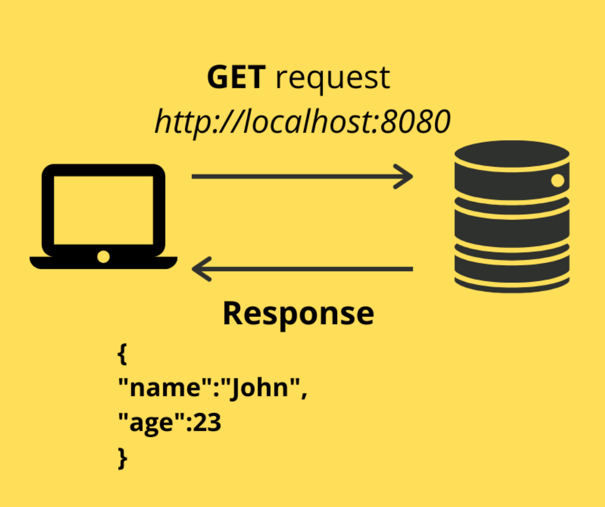

<div align="center">

</div>

<h1 align="center">Express.js Proxy CORS</h1>
<p align=center><i align="center">Servidor Proxy CORS baseado em Express.js</i></p>

<br>

<div align="center">

<a href="https://expressjs.com/pt-br/"></a>
<a href="https://www.javascript.com"></a>
<a href="https://nodejs.org/en/"></a>

<a href=""></a>
<a href=""></a>

<a href=""></a>
<a href=""></a>
<a href=""></a>

<a href=""></a>
<a href=""></a>
<a href="https://github.com/dexdevlab/expressjs-proxy-cors/blob/main/LICENSE"></a>

|| [Conteúdo](#section-conteudo) || [Stack](#section-stack) || [Instruções](#section-instrucoes) || [Variáveis de Ambiente](#section-vars) || [Notas de versão](#section-changelog) || [Autores](#section-autores) || [Contato](#section-contato) || [Licença](#section-licenca) ||

</div>

<hr>

<a name="section-conteudo">

## Conteúdo

</a>

<br>

Este projeto pode ser utilizado para implantar um servidor CORS que transmite os headers CORS (e quaisquer outros desejáveis) para a entrada e saída das requisições na forma de um middleware. Ele direciona todas as chamadas de rota, o qual suprime o caminho original e transfere o endereço de destino a ser acessado com os headers.

<hr>

<a name="section-stack">

## Stack

</a>

<br>

- **Linguagem Principal:** [Javascript](https://developer.mozilla.org/pt-BR/docs/Web/JavaScript)
- **Framework Principal:** [Node.js](https://nodejs.org/en/docs/)
- **Framework estrutural:** [Express.js](https://expressjs.com/pt-br/)
- **Gerenciador de Bibliotecas:** [Yarn](https://yarnpkg.com/getting-started)
- **Bibliotecas:** Para uma lista completa de bibliotecas e dependências nos mais variados escopos, conferir o arquivo [package.json](https://github.com/dexdevlab/expressjs-proxy-cors/blob/main/package.json).

<hr>

<a name="section-instrucoes">

## Instruções

</a>

<br>

### Utilizando o repositório como projeto

Faça um git clone ou o download do repositório, da forma que preferir

```bash

git clone https://github.com/dexdevlab/expressjs-proxy-cors.git

```

<br>

### Testando a aplicação

1 - Execute `yarn start` ou `npm run start` do terminal dentro do diretório do projeto. A aplicação irá ser executada na porta 3000 como padrão.

2 - Para realizar o redirecionamento de um site, faça uma requisição `GET` ou `POST` no seguinte formato: `${server_address}:${server_port}?url=${destination_url}`. Por exemplo: `http://localhost:3000?url=https://http.cat/100`. Esta requisição devolverá o endereço com os HEADERS pertinentes ao CORS na entrada e na saída, como um bypass.

<hr>

<a name="section-vars">

## Variáveis de Ambiente

</a>

<br>

Opcionalmente você pode usar um `.env` com a seguinte variável de ambiente:

| Variável      | Uso   | Valor Padrão |
|---------------|-------|--------------|
|`PORT` | Define uma porta para inicialização do Servidor Cors | 3000 |

<hr>

<a name="section-changelog">

## Notas de versão

</a>

<br>

### v1.0.0-240328

- Commit Inicial

<hr>

<a name="section-autores">

## Autores

</a>

<br>

<a href="https://github.com/dexdevlab/expressjs-proxy-cors/graphs/contributors">
  
</a>

<hr>

<a name="section-contato">

## Contato

</a>

<br>

Se você gostou deste projeto, dê uma <a href="https://github.com/dexdevlab/expressjs-proxy-cors" data-icon="octicon-star" aria-label="Star dexdevlab/expressjs-proxy-cors on GitHub">estrela</a>. <br>
Para contato, envie um email a: <a href="mailto:dex.houshi@hotmail.com">dex.houshi@hotmail.com</a>

<hr>

<a name="section-licenca">

## Licença

</a>

Licenciado sob a [MIT License](https://github.com/dexdevlab/expressjs-proxy-cors/blob/main/LICENSE).
